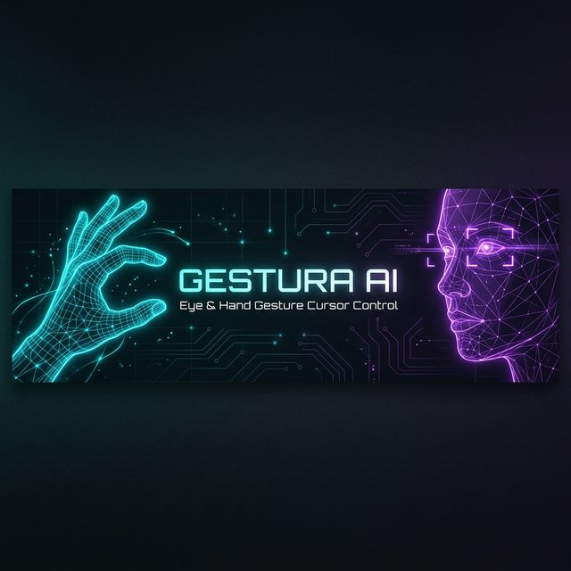

<p align="center">
  
</p>

<h1 align="center">🎯 Eye & Hand Gesture Cursor Control</h1>

<p align="center">
  <b>Control your computer cursor using just your eyes, face, and hand gestures — no mouse needed.</b>
</p>

<p align="center">
  
  
  
  
</p>

---

## 🚀 Overview

**Eye & Hand Gesture Cursor Control** is a hands-free computer interaction system that replaces your mouse with real-time gesture recognition. It uses computer vision and AI to track your **eye movements**, **facial expressions**, and **hand gestures** to control the cursor, click, scroll, and more.

Perfect for:
- ♿ **Accessibility** — enabling computer use for people with motor disabilities
- 🎮 **Hands-free computing** — control your PC without touching a mouse
- 🧪 **Computer vision experiments** — explore real-time face & hand tracking

---

## ✨ Features

### 👁️ Eye & Face Control (`face-detect.py`) — *Recommended*

| Gesture | Action |
|---|---|
| 👄 **Open mouth** (hold) | Toggle cursor control mode |
| 👃 **Move nose** (in input mode) | Move cursor in that direction |
| 😉 **Left eye wink** | Left click |
| 😉 **Right eye wink** | Right click |
| 😑 **Close both eyes** (hold) | Toggle scroll mode |
| 👃 **Move nose up/down** (scroll mode) | Scroll up / down |
| 👁️ **Iris tracking** (default mode) | Passive cursor follow |

### ✋ Hand Gesture Control (`hand_control.py`) — Two-Hand Mode

**Right Hand** 🖐️ → Cursor Movement

| Gesture | Action |
|---|---|
| ☝️ **Point index finger** | Move cursor on screen |

**Left Hand** 🤚 → Clicks & Scroll

| Gesture | Action |
|---|---|
| 🤏 **Pinch index + thumb** (quick) | Left click |
| 🤏 **Pinch index + thumb** (hold 3s) | Start drag |
| 🤏 **Pinch middle + thumb** | Right click |
| ✌️ **Peace sign (2 fingers up)** | Enter scroll mode |
| ✌️⬆️ **Peace sign — move hand up** | Scroll up |
| ✌️⬇️ **Peace sign — move hand down** | Scroll down |

### 👁️ Legacy Eye Control (`eye_control.py`)

> Uses **dlib** shape predictor (requires downloading the model file separately).  
> Same gesture mapping as `face-detect.py` but uses the older dlib + imutils pipeline.

---

## 📁 Project Structure

```
eye-hand-gesture-cursor-control/
├── face-detect.py       # 🌟 Main: Eye + face control (MediaPipe)
├── hand_control.py      # ✋ Hand gesture cursor control (MediaPipe)
├── eye_control.py       # 👁️ Legacy eye control (dlib)
├── utils.py             # 🔧 Helper functions (EAR, MAR, direction)
├── test_mp.py           # 🧪 MediaPipe installation test
├── requirements.txt     # 📦 Python dependencies
├── assets/
│   └── banner.png       # 🖼️ README banner image
├── LICENSE              # 📄 MIT License
└── README.md            # 📖 You are here
```

---

## ⚙️ Installation

### Prerequisites

- **Python 3.8** or higher
- A working **webcam**
- Windows / macOS / Linux

### Quick Setup

```bash
# 1. Clone the repository
git clone https://github.com/Lucifer-cell-metrix/eye-hand-gesture-cursor-control.git
cd eye-hand-gesture-cursor-control

# 2. Create a virtual environment (recommended)
python -m venv .venv

# Windows
.venv\Scripts\activate

# macOS / Linux
source .venv/bin/activate

# 3. Install dependencies
pip install -r requirements.txt
```

### ⚠️ dlib Note (only for `eye_control.py`)

The legacy eye controller requires the dlib shape predictor model:

1. Download [`shape_predictor_68_face_landmarks.dat`](http://dlib.net/files/shape_predictor_68_face_landmarks.dat.bz2)
2. Extract and place it in a `model/` directory:
   ```
   model/shape_predictor_68_face_landmarks.dat
   ```

> 💡 **You do NOT need dlib for the recommended `face-detect.py`** — it uses MediaPipe which downloads models automatically.

---

## 🎮 Usage

### Run Eye & Face Controller *(Recommended)*
```bash
python face-detect.py
```

### Run Hand Gesture Controller
```bash
python hand_control.py
```

### Run Legacy Eye Controller *(requires dlib model)*
```bash
python eye_control.py
```

### Test MediaPipe Installation
```bash
python test_mp.py
```

> Press **`Q`** or **`Esc`** to quit any controller.

---

## 🔧 Configuration

You can tune the sensitivity by editing the threshold values at the top of each script:

### Eye & Face Thresholds (`face-detect.py`)

| Variable | Default | Description |
|---|---|---|
| `MOUTH_AR_THRESH` | `0.6` | How wide the mouth must open to trigger |
| `MOUTH_AR_CONSECUTIVE_FRAMES` | `15` | Frames mouth must stay open |
| `EYE_AR_THRESH` | `0.19` | How closed the eye must be for detection |
| `EYE_AR_CONSECUTIVE_FRAMES` | `15` | Frames eyes must stay closed |
| `WINK_AR_DIFF_THRESH` | `0.04` | Min EAR difference to detect a wink |
| `WINK_CONSECUTIVE_FRAMES` | `10` | Frames wink must be held |

### Hand Controller Settings (`hand_control.py`)

| Variable | Default | Description |
|---|---|---|
| `SMOOTHING_FACTOR` | `5` | Cursor smoothing (higher = smoother) |
| `CLICK_THRESHOLD` | `20` | Pinch distance for click (pixels) |
| `CLICK_COOLDOWN` | `0.4` | Seconds between clicks |
| `SCROLL_SPEED` | `50` | Scroll sensitivity |

> 💡 **Tip:** Adjust thresholds based on your lighting conditions and distance from the camera.

---

## 📸 How It Works

### Eye Aspect Ratio (EAR)

Measures how open each eye is. A low EAR = closed eye.

```
EAR = (|P2 - P6| + |P3 - P5|) / (2 × |P1 - P4|)
```

- **Wink detected** → one eye EAR drops while other stays normal
- **Blink detected** → both eyes EAR drop simultaneously

### Mouth Aspect Ratio (MAR)

Detects if the mouth is open to toggle input mode.

```
MAR = (|A| + |B| + |C|) / (2 × |D|)
```

### Nose Direction Tracking

In input mode, the nose tip position relative to an anchor point determines which direction the cursor moves — enabling head-tilt cursor control.

### Hand Pinch Detection

Euclidean distance between fingertips and thumb tip is measured continuously. When distance drops below the threshold → pinch → click.

---

## 🛠️ Tech Stack

| Technology | Purpose |
|---|---|
| [**OpenCV**](https://opencv.org/) | Real-time video capture & image processing |
| [**MediaPipe**](https://mediapipe.dev/) | Face mesh (468+ landmarks) & hand tracking (21 landmarks) |
| [**PyAutoGUI**](https://pyautogui.readthedocs.io/) | System-level cursor control, clicks & scrolling |
| [**NumPy**](https://numpy.org/) | Numerical computations (distances, aspect ratios) |
| [**dlib**](http://dlib.net/) | Legacy face detection & 68-point landmark prediction |
| [**imutils**](https://github.com/PyImageSearch/imutils) | Image processing utilities (legacy module) |

---

## 🤝 Contributing

Contributions are welcome! Here's how:

1. **Fork** the repository
2. **Create** a feature branch: `git checkout -b feature/your-feature`
3. **Commit** your changes: `git commit -m 'Add your feature'`
4. **Push** to the branch: `git push origin feature/your-feature`
5. **Open** a Pull Request

---

## 📄 License

This project is licensed under the **MIT License** — see the [LICENSE](LICENSE) file for details.

---

## 🙏 Acknowledgments

- [MediaPipe](https://mediapipe.dev/) by Google — face & hand tracking models
- [dlib](http://dlib.net/) — shape predictor model
- [PyAutoGUI](https://pyautogui.readthedocs.io/) — system cursor control
- [OpenCV](https://opencv.org/) — real-time computer vision

---

<p align="center">
  Made with ❤️ by <a href="https://github.com/Lucifer-cell-metrix">Lucifer-cell-metrix</a>
</p>